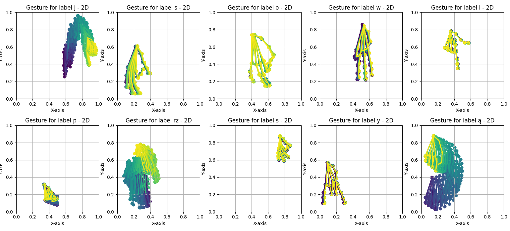
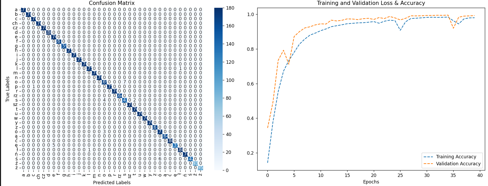

# Polish Sign Language Alphabet Recognition App
An application to support learning the Polish Sign Language

**Opis w języku polskim znajduje się [poniżej](#aplikacja-do-rozpoznawania-alfabetu-polskiego-języka-migowego).**

[Watch the video about the application](https://youtu.be/0AlX_skFt_s)

## 1. Running the application

### 1.1. Before the first launch

Make sure you have Python 3.12.0 installed on your computer. If yes, you need to install the required packages. To do this, run the following command in terminal inside the project directory:
```commandline
pip install -r requirements.txt
```

Make the migrations and migrate the database:
```commandline
python manage.py makemigrations
python manage.py migrate
```
To create superuser: 
```commandline
python manage.py createsuperuser
```

### 1.2. Launching the application

To run the application run the following command in terminal inside the project directory:
```commandline
python manage.py runserver
```

## 2. Application description

Goal of the project is to familiarize people with the Polish Sign Language as it's the means of communication for the 50 thousand Deaf people in Poland.
The application allows users to learn the alphabet of PSL by watching videos of signs and practicing showing the gestures themselves.

### 2.1. Model to recognize signs of the Polish Sign Language

The main part of the application is the sign recognition module, which uses a neural network to recognize the signs shown by the user.
The training data was collected over half a year and consists of over 5000 arrays of hand keypoints (detected using [MediaPipe library](https://ai.google.dev/edge/mediapipe/solutions/vision/gesture_recognizer/)). 
The data was additionally augmented 11 times (the original data was randomly rotated, translated, and scaled 10 times) to increase the size of the dataset.
Examples of the data can be seen below.



The neural network was trained using the TensorFlow library and during the training the dropouts and both Learning Rate Reduction and Early Stopping callbacks were used to prevent model overfitting to training data.
Plot of the model accuracy over epochs and final confusion matrix can be seen below.



### 2.2. Game to practise signs

To make the process of learning the signs more engaging, the application also includes a game where the user is supposed to spell a word (displayed as an image) using the Polish Sign Language alphabet.
For each correctly shown sign, the user receives a point and there is a bonus for completing the word. In settings, user can change which hand is used, how long the game lasts, and the difficulty level.

Statistics of each game are saved and can be accessed in the Django admin panel.

### 2.3. Signs tutorial

Apart from the sign recognition module, the application also allows user to learn the alphabet of the Polish Sign Language by watching videos and graphics.
After selecting a letter in the application, proper video is displayed.

## 3. Technologies

- Python,
- Django,
- TensorFlow,
- OpenCV,
- MediaPipe,
- JavaScript,
- HTML,
- CSS,
- Firebase.

## 4. Authors

Application was created by:
- [@mmcza](https://github.com/mmcza),
- [@dariak153](https://github.com/dariak153),
- [@MateuszGrudzinski](https://github.com/MateuszGrudzinski),
- [@mrj65](https://github.com/mrj65).

Also thanks to [@kacper-g48](https://github.com/kacper-g48), [@Dawidson174](https://github.com/Dawidson174) and [@Krasa35](https://github.com/Krasa35) for their help with gathering the training data.

# Aplikacja do rozpoznawania alfabetu Polskiego Języka Migowego

Aplikacja wspomagająca naukę Polskiego Języka Migowego.

[Obejrzyj film o aplikacji](https://youtu.be/0AlX_skFt_s)