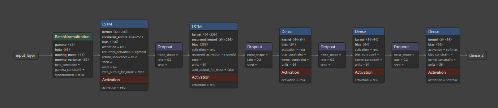
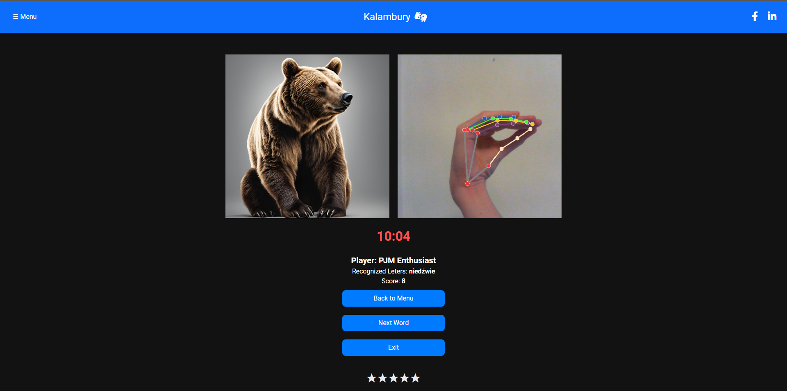
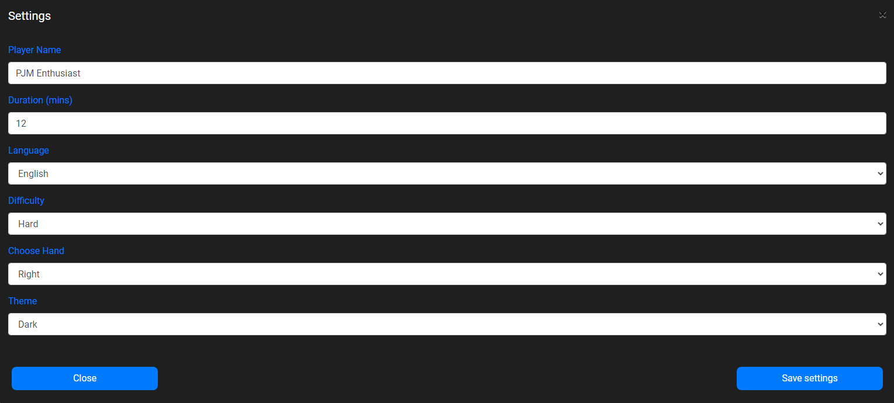

# Polish Sign Language Alphabet Recognition App
An application to support the process of learning the Polish Sign Language

**Opis w języku polskim znajduje się [poniżej](#aplikacja-do-rozpoznawania-alfabetu-polskiego-języka-migowego).**

[Watch the video about the application](https://youtu.be/0AlX_skFt_s)

[Website of the project](https://kolonaukowe-rai.github.io/PSL-Alphabet-Recognition-App/)

## 1. Running the application

### 1.1. Before the first launch

Make sure you have Python 3.12.0 installed on your computer. If yes, you need to install the required packages. To do this, run the following command in terminal inside the project directory:
```commandline
pip install -r requirements.txt
```

Make the migrations and migrate the database:
```commandline
python manage.py makemigrations
python manage.py migrate
```
To create superuser: 
```commandline
python manage.py createsuperuser
```

### 1.2. Launching the application

To run the application run the following command in terminal inside the project directory:
```commandline
python manage.py runserver
```

## 2. Application description

Goal of the project is to familiarize people with the Polish Sign Language as it's the means of communication for the 50 thousand Deaf people in Poland.
The application allows users to learn the alphabet of PSL by watching videos of signs and practicing showing the gestures themselves.

### 2.1. Data used to train the model

The main part of the application is the sign recognition module, which uses a neural network to recognize the signs shown by the user.
The training data was collected over half a year and consists of over 5000 arrays of hand keypoints (detected using [MediaPipe library](https://ai.google.dev/edge/mediapipe/solutions/vision/gesture_recognizer/)). 
Examples of the data can be seen below.


The data was additionally augmented 11 times (the original data was randomly rotated, translated, and scaled 10 times) to increase the size of the dataset.
It was later divided into training, validation, and test sets in the ratio of 80:10:10 and stratified to ensure that all gestures are included in the same ratio in each part of data.

### 2.2. Model to recognize signs of the Polish Sign Language

A sequential neural network was created with Tensorflow library to recognize the signs. It consists of an input layer, batch normalization, 2 LSTM layers, 3 dense layers and an output layer. Between each LSTM and dense layer, a dropout layer was added. 
For every layer, the ReLU activation function was used, except for the output layer, where the softmax function was used, and for optimization, the Adam optimizer was used.
Diagram of the model can be seen below.



During the training, both Learning Rate Reduction and Early Stopping callbacks were used to prevent model overfitting to training data.
The metric of the model was categorical accuracy and the loss function was categorical crossentropy.
Plot of change of the model accuracy over epochs and final confusion matrix can be seen below.


### 2.3. Game to practise signs

To make the process of learning the signs more engaging for user, the application includes a game where the user is supposed to spell a word (displayed as an image) using the Polish Sign Language alphabet.
For each correctly shown sign, the user receives a point and there is a bonus for completing the whole word. Currently there are 50 different words and each graphic was generated by an AI model from Canva.



In settings, user can change which hand is used, how long the game lasts, and the difficulty level.
Statistics of each game are saved and can be accessed in the Django admin panel. There is also a short tutorial available from the main menu that explains how to use the application.



### 2.4. Signs tutorial

Apart from the sign recognition module, the application also allows user to learn the alphabet of the Polish Sign Language by watching videos and graphics.
After selecting a letter in the application, proper video is displayed.


## 3. Technologies

- Python,
- Django,
- TensorFlow,
- OpenCV,
- MediaPipe,
- JavaScript,
- HTML,
- CSS,
- Firebase.

## 4. Authors

Application was created by:
- [@mmcza](https://github.com/mmcza),
- [@dariak153](https://github.com/dariak153),
- [@MateuszGrudzinski](https://github.com/MateuszGrudzinski),
- [@mrj65](https://github.com/mrj65).

Also thanks to [@kacper-g48](https://github.com/kacper-g48), [@Dawidson174](https://github.com/Dawidson174) and [@Krasa35](https://github.com/Krasa35) for their help with gathering the training data.

## 5. Summary

The application is in our opinion a great tool to learn the alphabet of the Polish Sign Language. In its previous version it was tested during a Scientific Fair and received a lot of positive feedback. We hope that this application will help to popularize the Polish Sign Language in an enjoyable way.

# Aplikacja do rozpoznawania alfabetu Polskiego Języka Migowego

Aplikacja wspomagająca naukę Polskiego Języka Migowego.

[Obejrzyj film o aplikacji](https://youtu.be/0AlX_skFt_s)

[Strona internetowa projektu](https://kolonaukowe-rai.github.io/PSL-Alphabet-Recognition-App/)


## 1. Uruchomienie aplikacji

### 1.1. Przed pierwszym uruchomieniem

Upewnij się, że masz zainstalowany Python 3.12.0 na swoim komputerze. Jeśli tak, zainstaluj wymagane pakiety. Aby to zrobić, użyj następującą komendę w terminalu w katalogu projektu:
```commandline
pip install -r requirements.txt
```

Wykonaj migrację i przeprowadź migrację bazy danych:
```commandline
python manage.py makemigrations
python manage.py migrate
```
Aby utworzyć superużytkownika: 
```commandline
python manage.py createsuperuser
```

### 1.2. Uruchomienie aplikacji

Aby uruchomić aplikację, użyj następującą komendę w terminalu w katalogu projektu:
```commandline
python manage.py runserver
```

## 2. Opis aplikacji

Celem projektu jest zapoznanie społeczeństwa z Polskim Językiem Migowym, który jest środkiem komunikacji dla 50 tysięcy osób niesłyszących w Polsce.
Aplikacja umożliwia naukę alfabetu PJM poprzez oglądanie filmów ze znakami i ćwiczenie pokazywania gestów podczas gry.

### 2.1. Dane użyte do uczenia modelu

Główną częścią aplikacji jest moduł rozpoznawania znaków, który wykorzystuje sieć neuronową do rozpoznawania gestów pokazanych przez użytkownika.
Dane treningowe były zbierane przez pół roku i składają się z ponad 5000 tensorów z punktami charakterystycznymi dłoni (wykrytych przy użyciu [biblioteki MediaPipe](https://ai.google.dev/edge/mediapipe/solutions/vision/gesture_recognizer/)). 
Przykładowe dane przedstawiono poniżej.


Dane zostały dodatkowo poddane augmentacji 11 razy (oryginalne dane losowo obracano, przesuwano i skalowano 10 razy), aby zwiększyć rozmiar zbioru danych.
Został on później podzielony na zestaw treningowy, walidacyjny i testowy w stosunku 80:10:10 oraz zapewniono, że wszystkie gesty zostaną uwzględnione w tym samym stosunku w każdym zestawie danych.

### 2.2. Model do rozpoznawania znaków Polskiego Języka Migowego

Do rozpoznawania znaków utworzono sekwencyjną sieć neuronową (skorzystano z biblioteki Tensorflow). Składa się ona z warstwy wejściowej, normalizacji wsadowej, 2 warstw LSTM, 3 warstw w pełni połączonych i warstwy wyjściowej. Pomiędzy każdą warstwą LSTM a warstwą gęstą dodano warstwę dropout. 
Dla każdej warstwy wykorzystano funkcję aktywacji ReLU, z wyjątkiem warstwy wyjściowej, gdzie wykorzystano funkcję softmax, a do optymalizacji wykorzystano optymalizator Adama.
Schemat modelu można zobaczyć poniżej.


Podczas treningu zastosowano callbacki zmniejszające szybkość uczenia się i wczesne zatrzymanie, aby zapobiec nadmiernemu dopasowaniu modelu do danych treningowych.
Wykres przebiegu treningu oraz ostateczną macierz pomyłek można zobaczyć poniżej.


### 2.3. Gra do ćwiczenia migania

Aby proces nauki znaków był bardziej angażujący dla użytkownika, w aplikacji dostępna jest gra, w której użytkownik ma za zadanie przeliterować słowo (wyświetlane w formie obrazka) z wykorzystaniem alfabetu Polskiego Języka Migowego.
Za każdy poprawnie pokazany znak użytkownik otrzymuje punkt oraz premię za zamiganie całego słowa. Obecnie dodano 50 różnych słów, a każda grafika została wygenerowana przez model AI z serwisu Canva.


W ustawieniach użytkownik może ustawić czy jest prawo- czy leworęczny, czas trwania rozgrywki i poziom trudności.
Statystyki każdej gry są zapisywane i można uzyskać do nich dostęp w panelu administracyjnym Django. Z menu głównego dostępny jest także krótki tutorial wyjaśniający sposób korzystania z aplikacji.


### 2.4. Poradnik dotyczący znaków

Oprócz modułu rozpoznawania znaków aplikacja umożliwia także naukę alfabetu Polskiego Języka Migowego poprzez oglądanie filmów i grafik.
Po wybraniu litery w aplikacji wyświetla się odpowiedni film.


## 3. Technologie

- Python,
- Django,
- TensorFlow,
- OpenCV,
- MediaPipe,
- JavaScript,
- HTML,
- CSS,
- Firebase.

## 4. Autorzy

Aplikację stworzyli:
- [@mmcza](https://github.com/mmcza),
- [@dariak153](https://github.com/dariak153),
- [@MateuszGrudzinski](https://github.com/MateuszGrudzinski),
- [@mrj65](https://github.com/mrj65).

Podziękowania także dla [@kacper-g48](https://github.com/kacper-g48), [@Dawidson174](https://github.com/Dawidson174) i [@Krasa35](https://github. com/Krasa35) za pomoc w gromadzeniu danych szkoleniowych.

## 5. Podsumowanie

Aplikacja jest, naszym zdaniem, doskonałym narzędziem do nauki alfabetu Polskiego Języka Migowego. W poprzedniej wersji została przetestowana na Festynie Naukowym, gdzie zebrała wiele pozytywnych opinii. Mamy nadzieję, że ta aplikacja pomoże w popularyzacji Polskiego Języka Migowego w przyjemny i angażujący sposób.